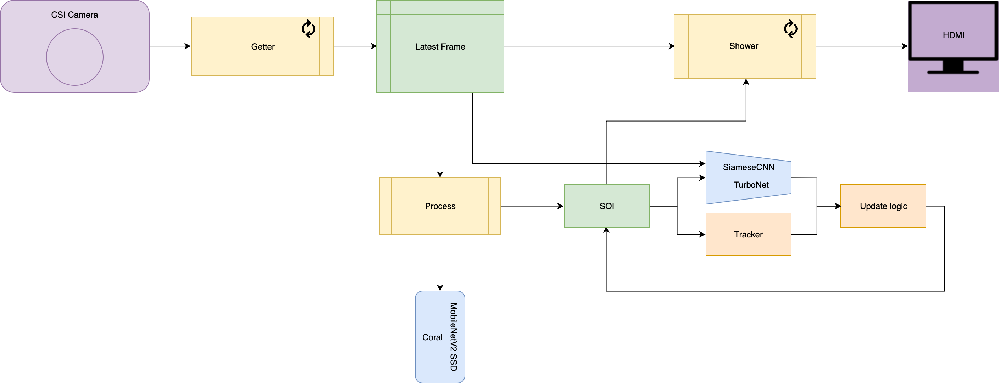

# JetsonNano_Coral_PersonTracking

## Requirements
- NVIDIA Jetson Nano with JetPack and Coral python API installed
- Google Coral USB Accelerator
- PiCameraV2 ( this could actually be any camera on the CSI interface )

## How does it work?
Images collected from the camera are processed by the Coral to extract all objects' bounding boxes, using MobileNetV2_SSD. Person's bounding boxes are saved, the rest gets binned.
"SOI" ( Subject of Interest / Ash ) is defined as the middle person by tapping the spacebar.
That person is tracked each frame by bounding box centroid, once every few frames it's similarity score is computed by a siamese CNN using 'TurboNet' classifier as embedding extractor. TurboNet is a small custom CNN based on SqueezeNet's fire modules.
If a jump of the centroid is too big, or the similarity score is too low, all other bounding boxes of persons are also tested with the siamese CNN, if no highly matching person is found for multiple frames in a row, the SOI is deregistered. From then on all bounding boxes will always be checked to see if SOI re-enters the FOV.

## How to run it?
- Make sure requirements are met
- Hook up a screen, a keyboard, a camera and the Coral to the Jetson Nano
- run dual_tracking.py with Python3
-- It will then optimise TurboNet to FP16 for the Jetson GPU, this might take a while
- when spacebar is tapped, the middle-most person in the FOV is selected as SOI

## Schematic

